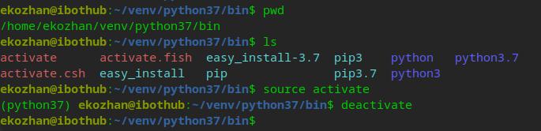

# 工作中的技能经验总结

> 采用 sphinx 和 Markdown 构建 ReadTheDocs 文档，工程模板 [https://github.com/readthedocs/template](https://github.com/readthedocs/template)

## 传统 rst 语法构建

[使用 ReadtheDocs 托管技术文档](https://www.jianshu.com/p/8aae1c1453ae)

**注意：运行时需要修改 make.bat 或 Makefile 文件中的 `SPHINXBUILD` 路径，Linux下，直接在Makefile所在目录运行 `make html` 即可**



## 采用 Markdown 语法

[recommonmark](https://github.com/readthedocs/recommonmark)

注意 `Sphinx` 版本

```
# for Sphinx-1.4 or newer
extensions = ['recommonmark']

# for Sphinx-1.3
from recommonmark.parser import CommonMarkParser

source_parsers = {
    '.md': CommonMarkParser,
}

source_suffix = ['.rst', '.md']
```

## requirements

```
pip install sphinx
pip install recommonmark
pip install sphinx-rtd-theme
```
